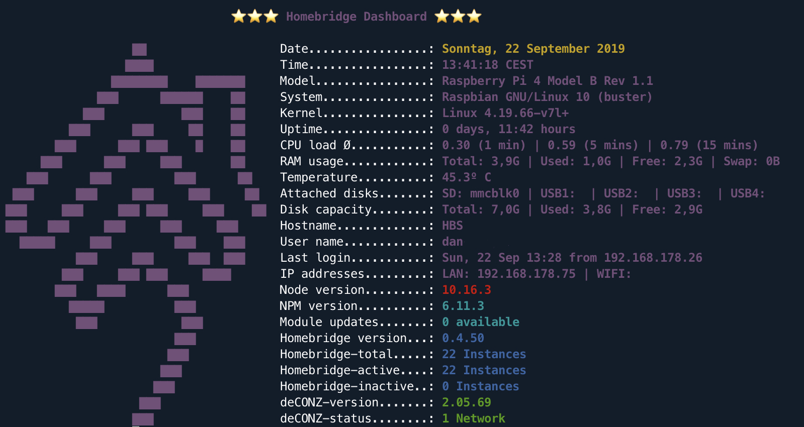
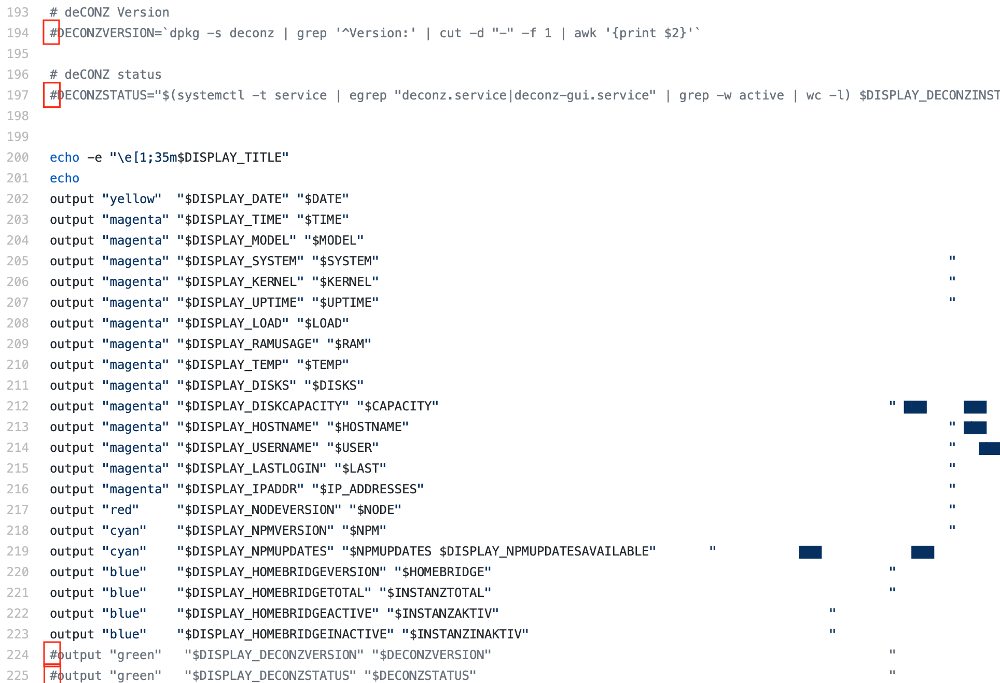

# homebridge-dashboard

This is a collaborative project of [@sschuste](https://github.com/sschuste) and [@nastras](https://github.com/nastras).

## What is homebridge-dashboard?

A welcome screen for homebridge called based on a bash script so this is not a regular homebridge-plugin. 
It is an additional tool for admins and users that displays an overview of important system and homebridge information in the shell.


## What does homebridge-dashboard offer you?

### Display of:
- System data
- NPM updates
- Homebridge, Node, NPM version
- Status of homebridge instances
- Status of deconz networks (See also Display of additional modules)



## Notes: 
- The script needs npm-check installed: (sudo) npm install -g npm-check
- The script was developed on a Raspberry Pi and I'm pretty sure that it won't work on an other OS than Raspberian. 
- And, even more important: this is work in progress.
- Version changes can be viewed in the [Changelog](https://github.com/Nastras/homebridge-dashboard/blob/master/Changelog.md).
```diff
! Feedback and improvements are welcome !
```

## Installation
Copy & paste this into your console:
```
wget -qO - https://raw.githubusercontent.com/nastras/homebridge-dashboard/master/dashboard-installer.sh | bash
```

The installer installs the script to */usr/local/bin/homebridge-dashboard.sh* and the language files to */usr/local/share/homebridge-dashboard*. To do so you need root access or sudo privileges on your computer.

If you don't have these rights or you don't want the files to be installed in these directories, you can install the dashboard to your home directory by cloning the git repository:
```
git clone https://github.com/nastras/homebridge-dashboard.git
```
This creates a directory named *homebridge-dashboard* in the current directory.

## Usage
```
homebridge-dashboard.sh [-p path][-l language]
```
If you have installed the standard installation as described above you only have to run homebridge-dashboard without any further arguments. The script takes some seconds to run, so please be patient.

## Language support
The script tries to determine automatically what language your computer is running on. To change the language you have to pass the language argument on the command line:
```
homebridge-dashboard.sh -l <language>
```

To switch to another language, run
```
homebridge-dashboard.sh -l en_gb.utf-8
```
or
```
homebridge-dashboard.sh --lang=en_gb.utf-8
```

Currently only english and german is supported. Feel free to add any other language by adding a new language file. See below how to do this.

| Language  | Argument    | Comment                         |
| --------- | ----------- | ------------------------------- |
| English   | en_gb.utf-8 |                                 |
| American  | en_us.utf-8 | Shows temperature in Fahrenheit |
| German    | de_de.utf-8 |                                 |

## Change the path to the language files
If your language files are located on another place than /usr/local/share/homebridge-dashboard you have to run homebridge-dashboard.sh with the path argument:

```
homebridge-dashboard.sh -p <path>
```
For instance:
```
homebridge-dashboard.sh -p /home/pi/homebridge-dashboard/i18n
```
or 
```
homebridge-dashboard.sh --path=/home/pi/homebridge-dashboard/i18n
```

## Writing language files
First you have to determine the language of your computer with:
```
locale | grep LANG=
```

You'll get something like LANG=fr_FR.UTF-8 if your computer is set to french, or maybe LANG=ru_RU.utf-8 if it's running in russian language. The part right from the equal sign in lower characters is the file name of your new language file, i.e. fr_fr.utf-8.

Copy the english language file to your new file name:
```
cp /usr/local/share/homebridge-dashboard/en_gb.utf-8 fr_fr.utf-8
```
Then edit the new file:
```
nano fr_fr.utf-8
```
and do your translation. When you're done copy the file to your language directory:
```
sudo cp fr_fr.utf-8 /usr/local/share/homebridge-dashboard/
```

and run homebridge-dashboard.sh without arguments or as:
```
homebridge-dashboard.sh --lang=fr_fr.utf-8
```

## Automatic start on login

Customize /home/pi/.profile
The path of the script we have to insert in the /home/pi/.profile in the last line.

Example: /usr/local/bin/homebridge-dashboard.sh
```
sudo nano /home/pi/.profile
```

## Display of additional modules

Open the script homebridge-dashboard.sh to edit. At the end of the script the respective module is activated by removing the # symbols. Hint: currently there is only deconz networks as additional module.

Example: to activate the deconz module remove the # at the beginning of the line an save:
- 194
- 197
- 224
- 225 



## Removing the default message's on login

### Message 1
Remove the contents of the file and save.
```
sudo nano /etc/motd
```

### Message 2
Open file and comment out second line uname -snrvm with # and save.

Example: #uname -snrvm
```
sudo nano /etc/update-motd.d/10-uname
```

### Message 3
Search and change line PrintLastLog yes in PrintLastLog no and save.
```
sudo nano /etc/ssh/sshd_config
```
